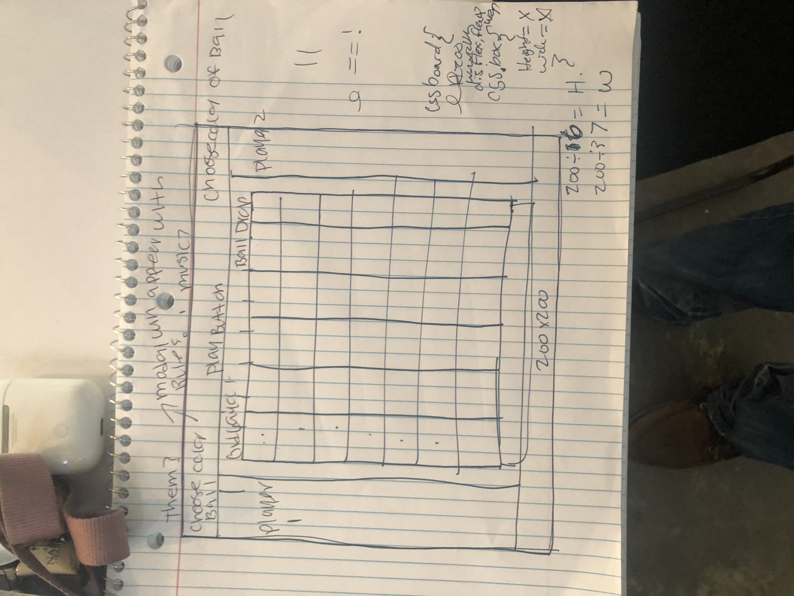

 # Connect Four 

 project #1.

 Connect Four  is a two-player connection game in which the players  take turns playing  in the 7 X 6 grid.  The objective of the game is to be the first to form a horizontal, vertical, or diagonal. Once the user comes to the site, the users will determine which one goes first. 
 once someone has won the a alert box will pop displaying which player won. The game will reset it self an the game can be played again.

http://amazing-franklin-88973f.netlify.com/

# Wire Frame/ 

https://trello.com/b/G5wLYMYO/wdi-1

 # Technologies Used 
1. Html
2. CSS
3. JavaScript
4. JQuery

#Future Features
1. Make the site more active
2. Add more animations
4. have the player choose their own color scheme 
5. have the diagonal working
6. Add a rule/how to play list
7. create Buttons
8. sound effects

# sources 
https://www.youtube.com/watch?v=531FRc8e2Sk
https://www.youtube.com/watch?v=4AIop6P-jHE
https://www.w3schools.com/
https://fonts.google.com/
https://stackoverflow.com/
https://learn.freecodecamp.org/
https://www.google.com/search?ei=5z8ZXMXlJu-I_QbMt5KwBg&q=taylor+swift+.+gifs&oq=taylor+swift+.+gifs&gs_l=psy-ab.3..0i22i30l10.32.2169..2313...1.0..0.292.953.4j1j2......0....1..gws-wiz.......35i39j0i67j0i131i20i263j0i10j0i22i10i30.mrM313ROPNM
https://en.wikipedia.org/wiki/Connect_Four